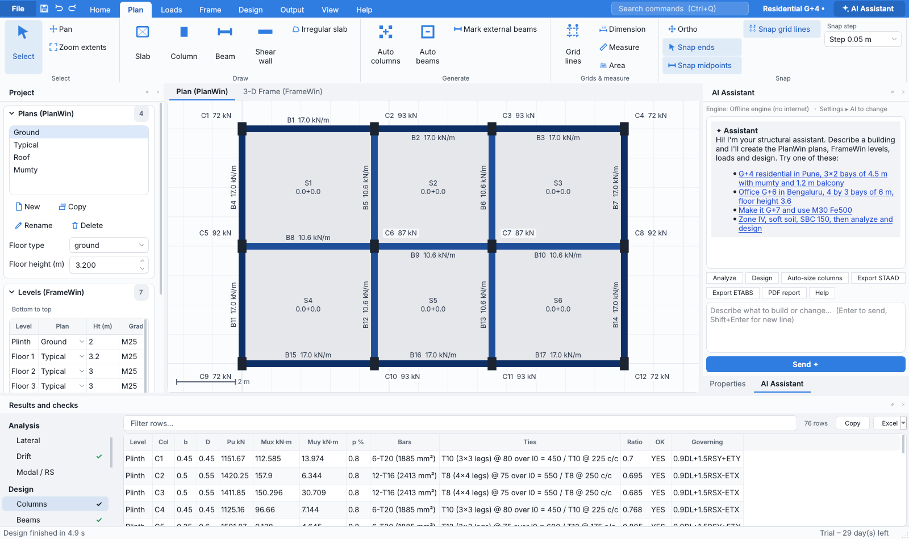
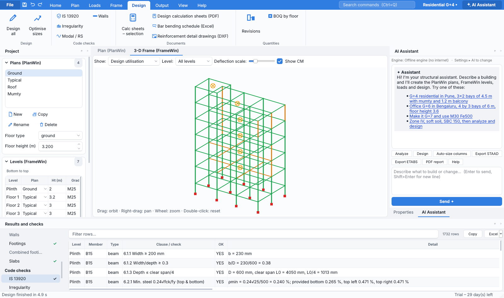

# PlanWin AI Pro

**AI-assisted structural pre-processor, 3-D analysis and IS-code design for RCC framed buildings.**
This is the Python successor to Computer Help's PlanWin / FrameWin (VB6). It keeps the familiar PlanWin workflow:
slab → beam → column load take-down, level-wise plans and FrameWin stacking. On top of that it adds a built-in 3-D solver,
IS 456 design, STAAD/ETABS export and an AI assistant that builds and edits models from plain-English prompts.




> Results are design aids. They must be reviewed and signed by a qualified structural engineer before use for construction.

---

## Download & install (Windows 10/11, 64-bit)

Each build on GitHub Actions produces three files. Find them under **Actions → latest run → Artifacts**, or under **Releases** for tagged versions:

| File | Use |
|---|---|
| `PlanWinAIPro-<version>-win64-setup.exe` | Installer: Start-menu entry, desktop icon, `.pwai`/`.plw` file association, uninstaller |
| `PlanWinAIPro-<version>-win64-portable.exe` | Single exe that runs from anywhere with no install. First start takes about 10 s while it unpacks |
| `PlanWinAIPro-<version>-win64-folder.zip` | Unzip and run `PlanWinAIPro.exe`. Fastest start |

The exe is not code-signed yet, so Windows SmartScreen may warn on first run (*More info → Run anyway*). See *Roadmap* for signing.

## Quick start

1. **File ▸ New from template** (10 ready buildings, all pre-optimised and passing design), or press **Ctrl+K** and type, for example:
   *"G+4 residential in Pune, 3x2 bays of 4.5 m with mumty and 1.2 m balcony"*.
2. **PlanWin tab:** draw slabs (`R` rectangle, `P` polygon), place columns (`C` or *Auto columns*), then use *Auto beams*.
   Press **F5** to run the load take-down. Applied load must equal the column reactions (≈ 0 % difference).
3. **Levels table:** assign a plan to each level, with storey heights and concrete grade.
4. **FrameWin ▸ Project settings:** seismic zone, soil, importance factor, wind city / Vb, SBC.
5. **F6** builds and analyses the 3-D frame. **F7** designs all members. **FrameWin ▸ Optimise sizes** fixes any failures automatically.
6. Export to **STAAD (.std)**, **ETABS (.e2k)**, **DXF 2-D/3-D**, **Excel** or **PDF**.

Shortcuts: `S` select · `H` pan · `R` rectangle slab · `P` polygon slab · `C` column · `B` beam · `D` measure ·
`F` zoom extents · `Del` delete · `Ctrl+Z / Y` undo/redo · `Ctrl+K` AI panel · `F1` help.
Double-click a beam to see its BM/SF diagrams.

---

## Features

### Carried over from PlanWin / FrameWin (re-implemented)
1. Level-wise plans: one plan reused for many floors (e.g. a "Typical" plan for floors 1–10)
2. Rectangular and irregular slabs, with slab loads (live, floor finish, other) and self weight
3. Two-way 45° yield-line, one-way, cantilever and on-grade slabs, plus the CG method for irregular slabs
4. Auto columns ("Judge") at slab corners and Auto beams along slab edges
5. Main/secondary beam resolution, T-junctions, cantilever beams and floating columns
6. Wall, plaster and parapet loads computed from floor height and the beam depth above
7. Point loads (up to 20) and wedge/part loads on beams
8. Load take-down with an equilibrium check (applied load = reactions) and slab/beam loading error reports
9. Continuous-beam BM/SF diagrams at the 1/8 points, with steel required
10. Copy plan, copy selection to a new plan, move/copy/mirror, select window, auto renumber
11. FrameWin stacking by column mark, auto joints at beam–beam junctions, floating columns
12. Column auto-size from vertical load, per-level column size grid with copy up/down
13. Wind loads (IS 875-3) by city or Vb, terrain category, k1/k3/k4, parapet height
14. Seismic loads (IS 1893-1:2016, equivalent static) by zone, I, R, soil type and infill
15. Design of columns (biaxial), beams, isolated footings and slabs, plus reports
16. DXF export on PlanWin layers and DXF import from SLAB / COLUMN / BEAM layers
17. Water-tank and other joint loads, and support conditions

### New in PlanWin AI Pro
18. **AI assistant side panel** (open/close with Ctrl+K). It creates and edits models, runs analysis, design and exports from prompts
19. **Multi-provider AI:** Claude, OpenAI or a local Ollama model. There is also an **offline engine** that needs no internet or API key
20. API keys are stored in the Windows Credential Manager. Only a model summary is sent to the AI provider, never drawings
21. **10 pre-built, pre-optimised templates:** bungalow, G+4 and G+7 residential, office, shopping centre, IT park, school, hospital, industrial, and the manual tutorial
22. **Imports legacy PlanWin `.plw` files** (v1.x–3.x tested on all 16 bundled samples; 5.x in beta), converting tonnes to kN
23. **Built-in 3-D frame solver** (6 DOF/node), so no STAAD/ETABS is needed for preliminary analysis
24. Direct **ETABS `.e2k` export** with stories, sections, property modifiers, loads and combinations
25. STAAD export with explicit cracked properties (AX/IX/IY/IZ) and BETA orientation
26. IS 1893:2016 updates: cracked sections (0.35 Ig beams / 0.70 Ig columns), **accidental torsion ±0.05b**, minimum Ah, the T ≤ 0.1 s rule
27. 25 IS load combinations (37 with accidental torsion), plus service combinations
28. Biaxial column design by **strain compatibility** using the IS 456 Fig 23A steel curve, slenderness with the k reduction, and tension + moment
29. Beam design: doubly reinforced sections, stirrup fy capped at 415, deflection check by span/d with the modification factor, and bar selection
30. Footings: SBC with 25 % increase for lateral cases, full-contact check, moments, punching and one-way shear, and an overlap warning
31. Slabs: IS 456 Table 26/27 coefficients, minimum steel, and the deflection rule (cl 24.1)
32. **Storey drift check** (0.004 h) per level and direction
33. **Optimise sizes:** iteratively enlarges failing columns and beams and fixes drift
34. **BOQ and cost estimate:** concrete by grade, steel (kg/m³), formwork and ₹ rates
35. **Excel workbook** with 14 sheets and a **PDF report** with a disclaimer and footer
36. 3-D view (no GPU needed): orbit, level filter, deflected shapes, colour by design utilisation
37. Undo/redo (60 steps), autosave every 5 minutes with crash recovery, recent files
38. Light and dark themes, high-DPI support, properties panel with multi-select "Set Value"
39. Issues list: double-click to zoom to the problem on the plan
40. **Licensing:** Ed25519-signed licence keys plus a 30-day trial (trial exports are watermarked)
41. Command line for automation: `PlanWinAIPro.exe cli ...` (see below)
42. Installer with file associations; self-test (`--selftest`) run in CI on every build

---

## AI assistant

| Engine | Setup | Notes |
|---|---|---|
| Offline (default) | none | Rule-based. Understands buildings, loads, zones, materials and workflow commands |
| Claude | Tools ▸ AI settings → paste an Anthropic API key | Default model `claude-sonnet-5-5` (editable) |
| OpenAI | paste an OpenAI key | Any chat-completions model; uses JSON mode |
| Ollama | install Ollama, `ollama pull llama3.1` | Fully local / private |

The assistant replies with JSON **actions** (`new_building`, `modify_building`, `set_loads`, `set_location`,
`set_seismic`, `set_wind`, `set_materials`, `set_sbc`, `autosize_columns`, `optimize_sizes`, `analyze`, `design`, `export`).
Actions are validated and executed by the app, and every AI change can be undone with Ctrl+Z.

## Command line

```
PlanWinAIPro.exe cli templates
PlanWinAIPro.exe cli new --template office_g5 --out office.pwai
PlanWinAIPro.exe cli ask "G+4 residential in Pune, 3x2 bays of 4.5 m" --out model.pwai
PlanWinAIPro.exe cli run model.pwai --design --export staad etabs excel pdf --out-dir results
PlanWinAIPro.exe cli import-plw OLD.plw --out converted.pwai
```

## Build from source

```bash
python -m venv .venv && .venv\Scripts\activate          # Python 3.12, 64-bit
pip install -r requirements-dev.txt
python -m pytest -q                                      # 123 tests
python -m planwin_ai                                     # run the app
scripts\build_windows.bat                                # exe + portable + installer (needs Inno Setup 6)
```

**Releases:** bump `__version__` in `planwin_ai/__init__.py` (the only place the version lives), update
`CHANGELOG.md`, then either push a tag `vX.Y.Z` or run the *build-windows* workflow manually with **release** ticked.
GitHub Actions tests, builds, self-tests and publishes the release (the manual run creates the tag itself).
Versioning follows **Semantic Versioning** (MAJOR.MINOR.PATCH).

After changing the generator or design code, rebuild the template library with `python tools/build_templates.py`.

## Project structure

```
planwin_ai/
  core/      model.py (data model) · geometry.py · plan_engine.py (PlanWin) · beamcalc.py
             frame.py (FrameWin 3-D) · solver.py (3-D stiffness) · lateral.py (IS 1893 / IS 875) · generator.py
  design/    is456.py (beam, column, footing, slab) · runner.py (design all, BOQ, autosize, optimise)
  io/        project_io (.pwai) · legacy_plw · staad · etabs · dxf_io · reports (Excel/PDF) · cities
  ai/        actions (schema + executor) · offline parser · providers (Claude/OpenAI/Ollama) · assistant · templates
  gui/       main_window · canvas (plan editor) · view3d · panels · chat (AI dock) · dialogs · theme
  licensing/ license.py (Ed25519 verify + trial)
  data/      cities.csv · legacy_samples/*.plw · templates/*.pwai
tools/       keygen.py (issue licences – internal) · build_templates.py
packaging/   PyInstaller spec · Inno Setup script · version info
tests/       123 tests: closed-form solver checks, IS-code values, legacy import, exports, AI, licensing, GUI smoke
```

## Licensing (Computer Help internal)

```
python tools/keygen.py issue --key planwin_license_private_key.pem --name "Client Name" \
       --company "ABC Consultants" --email a@b.in --expires 2027-12-31 --out ABC.lic
```

The customer loads the `.lic` file under Tools ▸ Licence. **Never commit the private key.** The public key is in
`planwin_ai/licensing/license.py`. To rotate keys, run `keygen.py init` and replace `PUBLIC_KEY_B64` (existing licences then stop working).

## Engineering basis & known limitations (v1.0)

- **Codes:** IS 456:2000, IS 875 Parts 1–3 (2015), IS 1893-1:2016 (equivalent static method), IS 13920 minimum column size.
- **Limitations, see roadmap:**
  - no response-spectrum (modal) analysis
  - no rigid diaphragm, shear walls or grouped/legged columns
  - no rigid end offsets
  - no combined footings (flagged when footings overlap)
  - no torsion design of beams
  - no ductile detailing per IS 13920
- City wind speeds and zones: major cities follow IS 875-3:2015 / IS 1893-1:2016. Others come from the legacy PlanWin table. Always verify for the site.
- Load take-down uses PlanWin's simple-span assumption by default; continuous beams are optional in Settings.

## Roadmap

- **1.1:**
  - response spectrum
  - rigid diaphragm
  - shear walls and group columns
  - rigid offsets
  - combined footings
  - code signing of the exe
- **1.2:**
  - IS 13920 ductile detailing
  - BBS export (Shanku integration)
  - column/footing schedule DXF drawings
- **2.0:**
  - IFC/Revit export
  - Structura viewer link
  - cloud project sync
  - multi-user licences

© Computer Help / Building Software — www.buildingsoftware.in — Proprietary software, see LICENSE.
